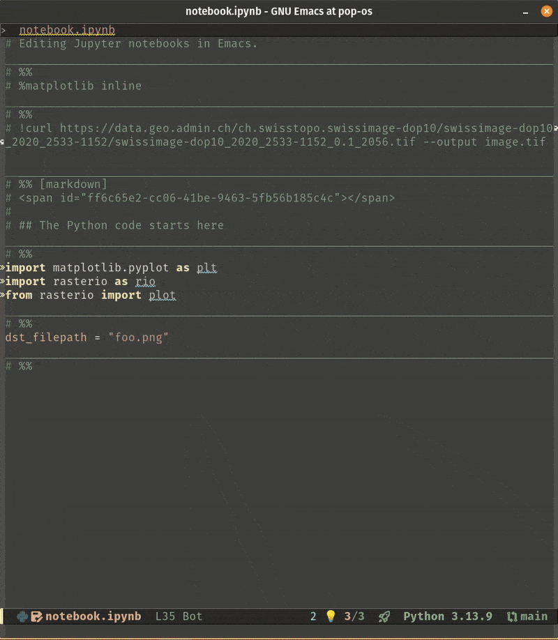

[](https://github.com/martibosch/snakemacs/actions/workflows/build.yaml)
[](https://results.pre-commit.ci/latest/github/martibosch/snakemacs/main)

# snakemacs


emacs30 setup for Python and Jupyter with [pixi](https://pixi.sh)

## Features

- Jupyter-like mode using plain-text Python buffers with [code-cells](https://github.com/astoff/code-cells.el), [emacs-jupyter](https://github.com/emacs-jupyter/jupyter) and [jupytext](https://github.com/mwouts/jupytext) (see the blog post ["Jupyter in the Emacs universe"](https://martibosch.github.io/jupyter-emacs-universe) for more details), with [pixi-kernels](https://github.com/renan-r-santos/pixi-kernel) to run Jupyter kernels with the per-directory pixi environments.
- _Fast_ (with [emacs-lsp-booster](https://github.com/blahgeek/emacs-lsp-booster)) IDE features using [lsp-mode](https://github.com/emacs-lsp/lsp-mode) with [basedpyright](https://github.com/detachhead/basedpyright) and [ruff](https://github.com/astral-sh/ruff).



### How to run notebooks

Within a [pixi workspace](https://pixi.sh/latest/first_workspace):

1. Open a notebook (using `C-x C-f`) or create a new one using `M-x my/new-notebook` and then entering a name and selecting "Python (Pixi)" as kernel.
2. Start a [jupyter REPL](https://github.com/emacs-jupyter/jupyter?tab=readme-ov-file#repl) by running `M-x jupyter-run-repl` and selecting "Python (Pixi)" as kernel. This will run a jupyter REPL in a dedicated buffer with the [default environment](https://pixi.sh/latest/tutorials/multi_environment) of the pixi workspace.
3. From the Jupyter notebook buffer, run `M-x jupyter-repl-associate-buffer` and select the previously created REPL buffer to associate it to the notebook. You may now execute code cells from the notebook buffer using `C-c C-c` (or `M-x code-cells-eval`).

Note that the kernel will correspond to the [default pixi environment](<(https://github.com/renan-r-santos/pixi-kernel?tab=readme-ov-file#pixi-environments)>) of the workspace. If you need to use another environemnt, see the "Pixi environments and IDE features for Python buffers" section below.

## Installation

This setup uses emacs 30 and pixi. The only requirement is to [install pixi](https://pixi.sh/latest/installation), then you can follow the steps below:

1. Navigate to your home folder and clone the repository, and navigate to the (newly-created) `~/.emacs.d/` folder:

   ```bash
   cd ~
   git clone https://github.com/martibosch/snakemacs ~/.emacs.d
   cd .emacs.d
   ```

   Alternatively, you can clone this repository into any directory and use [chemacs2](https://github.com/plexus/chemacs2) to set up `snakemacs` as a (potentially default) profile.

2. Run emacs for the first time from the shell so that all packages can be installed (if you do not run it from the shell, `libvterm` may not be installed properly):

   ```bash
   pixi run emacs
   ```

The only external (non-pixi) dependencies are:

- [emacs-lsp-booster](https://github.com/blahgeek/emacs-lsp-booster) which you can set it up by [downloading the prebuilt binary and placing it to somewhere in your `$PATH`](https://github.com/blahgeek/emacs-lsp-booster?tab=readme-ov-file#obtain-or-build-emacs-lsp-booster). Using emacs-lsp-booster is _optional but highly recommended_ to improve the performance of the LSP features.
- [Nerd Fonts](www.nerdfonts.com) for the icons, which you can install from inside emacs by running `M-x nerd-icons-install-fonts`.

## Caveats

### Pixi environments and IDE features for Python buffers

In order to get the IDE features from the per-directory pixi environment, you can customize the `python.pythonPath` setting of basedpyright [by adding a `.dir-locals.el` file with the following content](https://github.com/emacs-lsp/lsp-pyright/issues/52):

```emacs-lisp
((python-mode . ((eval . (with-eval-after-load 'lsp-pyright
                           (progn
                             (lsp-register-custom-settings
                              `(("python.pythonPath" "D:/path/to/miniconda3/envs/stringle_pro/python.exe"))))
                           )))))
```

at the project's root (note that this set up uses [projectile](https://github.com/bbatsov/projectile) to detect the appropriate project).

### Jupyter Pixi kernels

In order to run jupyter with the per-directory kernels, the snakemacs pixi environment includes [pixi-kernel](https://github.com/renan-r-santos/pixi-kernel). Therefore, from the appropriate project directory, you can run `M-x jupyter-run-repl` and select the "Python (pixi)" kernel, which will use the correct pixi environment for that project. **However, this requires that the pixi environment includes the `ipykernel` package,** which you can install by running `pixi add ipykernel` from the appropriate project directory.

### Jupyter kernels for multiple Pixi environments

While [it is possible to choose a pixi environment for the Jupyter kernel in JupyterLab](https://github.com/renan-r-santos/pixi-kernel?tab=readme-ov-file#pixi-environments), this setup currently does not provide a user interface for this feature.

If you need to run a REPL with a different pixi environment, you can either:

- Set the environment variable `PIXI_KERNEL_DEFAULT_ENVIRONMENT` to the desired Pixi environment.
- Open a terminal by running `M-x vterm`, then in the terminal run (from the appropriate directory) the command `pixi run -e <your-environment> jupyter kernel`, which will show a path to a "Connection file". Then run `M-x my/jupyter-connect-repl` and select the appropriate connection file (which will be suggested in the minibuffer). This will open a Jupyter REPL buffer connected to the specified pixi environment.

### Compiling zmq with emacs as pixi global tool

The [emacs-jupyter](https://github.com/emacs-jupyter/jupyter) package relies on [emacs-zmq](https://github.com/emacs-jupyter/jupyter), which must be built as an emacs module. When installing emacs as a [pixi global tool](https://pixi.sh/latest/global_tools/introduction), i.e., running `pixi global install emacs`, I did not manage to [build zmq](https://github.com/nnicandro/emacs-zmq?tab=readme-ov-file#building) in my ubuntu computer - I got some compilation errors even with all the required dependencies installed as pixi global tools.

If you want to install emacs as a pixi global tool, you may first follow the steps described in the "Installation" section above and answer `n` (No) to `Check for compatible module binary to download?` so that the module is compiled using the customized settings from your snippet above, i.e., then answering `y` to `ZMQ module not found. Build it?`. Then, if you have installed emacs as a pixi global tool, you may simply run `emacs` from the terminal and you will have the features of the previously-built ZMQ module.

### Code cells and LSP formatting

The [ruff language server](https://docs.astral.sh/ruff/editors/#language-server-protocol) provides formatting capabilities via the LSP protocol. However, when editing [Jupyter notebooks as Python scripts via code-cells](https://github.com/astoff/code-cells.el), ruff needs to format a plain-text Python file rather than a JSON notebook. Therefore, in this set up the `lsp-format-buffer` and `lsp-organize-imports` hooks are deactivated in Python mode and instead ruff operates by sending the buffer content via standard input using [reformatter](https://github.com/purcell/emacs-reformatter).

## See also

- ["Jupyter in the Emacs universe"](https://martibosch.github.io/jupyter-emacs-universe) for more details about alternative Jupyter notebook emulations within emacs.
- Many concepts of this setup are inspired by the excellent post ["Replacing Jupyter Notebook with Org Mode"](https://sqrtminusone.xyz/posts/2021-05-01-org-python) by Pavel Korytov. In fact, several functions such as `M-x my/jupyter-connect-repl` are essentially copied from there.
