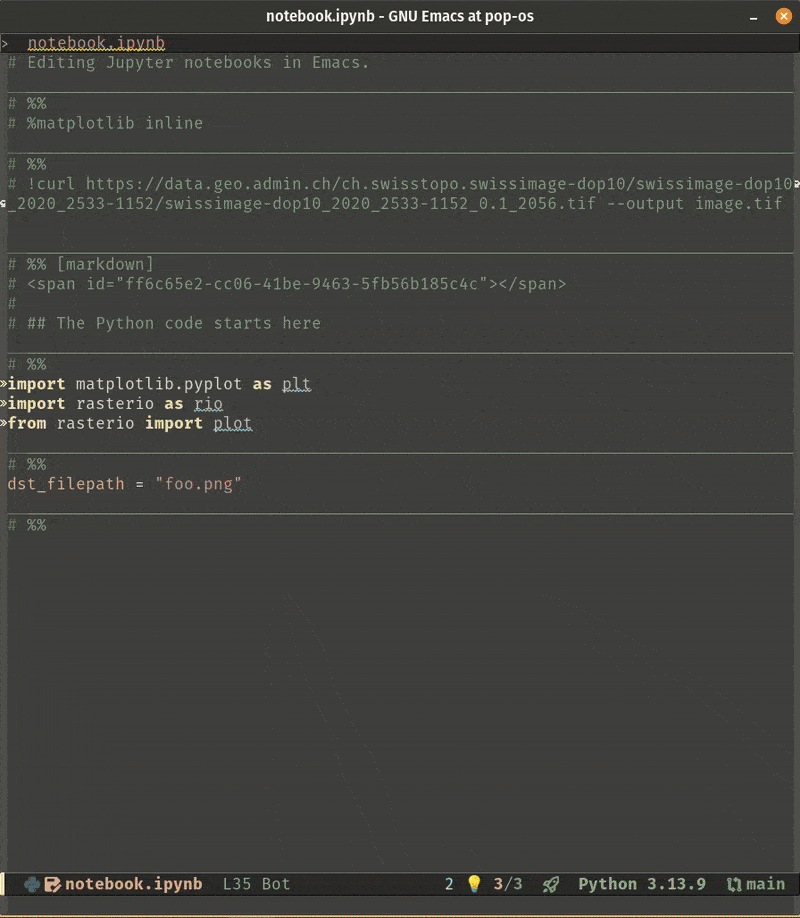

The core idea of snakemacs is that you never edit JSON. Notebooks are opened as
plain-text Python buffers via [jupytext](https://github.com/mwouts/jupytext), and
[code-cells](https://github.com/astoff/code-cells.el) gives you cell navigation and
evaluation on top of an ordinary `python-mode` buffer - so LSP, formatting and every
other editing feature work exactly as they do in a normal script.

## Running a notebook

From within a [pixi workspace](https://pixi.sh/latest/first_workspace):

1. Open a notebook with `C-x C-f`, or create one with `M-x my/new-notebook`, entering
   a name and selecting "Python (Pixi)" as kernel.
2. Start a
   [Jupyter REPL](https://github.com/emacs-jupyter/jupyter?tab=readme-ov-file#repl)
   with `M-x jupyter-run-repl`, again selecting "Python (Pixi)". This opens a REPL
   buffer bound to the
   [default environment](https://pixi.sh/latest/tutorials/multi_environment) of the
   workspace.
3. From the notebook buffer, run `M-x jupyter-repl-associate-buffer` and pick the
   REPL buffer you just created. You can now evaluate cells with `C-c C-c` (that is,
   `M-x code-cells-eval`).

:::{note}
The kernel corresponds to the **default** pixi environment of the workspace. To use
another one, see [Environments and kernels](repl-and-kernels.md).
:::

## Cell formatting

Because a notebook is a plain-text Python buffer here, `ruff` has to format a script
rather than a JSON notebook. The `lsp-format-buffer` and `lsp-organize-imports` hooks
are therefore disabled in `python-mode`, and formatting instead goes through
[reformatter](https://github.com/purcell/emacs-reformatter), which pipes the buffer
through `ruff` on standard input. See [IDE features](ide.md).
